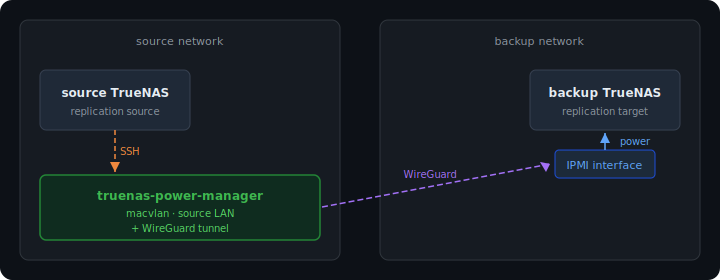

# TrueNAS Power Manager

Keeps a backup TrueNAS server off when it doesn't need to be running. It powers the machine on before the nightly backup window and shuts it down gracefully once replication finishes — without ever cutting off a transfer mid-way.

Power is controlled through the server's IPMI interface using `ipmitool`, which runs directly inside the container. The container sits on the source TrueNAS network and reaches the backup network's IPMI through a WireGuard tunnel. Backup status is checked by SSHing into the source TrueNAS and querying replication task state via `midclt`.

Scheduling is intentionally left to [Ofelia](https://github.com/mcuadros/ofelia), which runs alongside it in Docker. This keeps the binary itself simple — each invocation does exactly one thing and exits.

## How it works

The binary exposes five commands:

| Flag | What it does |
|---|---|
| `-power-on` | Powers on the backup server via IPMI |
| `-power-off` | Checks replication status first; aborts (exit 1) if a task is still running |
| `-force-off` | Powers off unconditionally, no backup check |
| `-status` | Prints the current IPMI chassis power state |
| `-backup-status` | Prints whether any replication task is currently running |

`-power-off` exiting with code 1 when the backup is still running is deliberate — it signals a failure so the scheduler can alert you and you can re-run manually once the backup finishes.

## Network topology



The `truenas-power-manager` container sits on the source LAN via a macvlan interface. It SSHes into the source TrueNAS to check replication status, and reaches the backup network's IPMI through a WireGuard sidecar.

## Configuration

Configuration is read from a `.env` file. Environment variables always take precedence over the file.

### IPMI

| Variable | Required | Default | Description |
|---|---|---|---|
| `IPMI_HOST` | yes | | IP address of the IPMI interface (in the backup network) |
| `IPMI_USER` | yes | | IPMI username |
| `IPMI_PASSWORD` | yes | | IPMI password |
| `IPMI_PRIVILEGE` | no | `ADMINISTRATOR` | Privilege level passed to ipmitool (`ADMINISTRATOR`, `OPERATOR`, `USER`) |

### Source TrueNAS

The machine that *initiates* replication (push). Task state is only tracked here, not on the backup target.

| Variable | Required | Default | Description |
|---|---|---|---|
| `TRUENAS_HOST` | yes | | Hostname or IP |
| `TRUENAS_USER` | yes | | SSH username |
| `TRUENAS_PASSWORD` | one of | | SSH password |
| `TRUENAS_KEY_FILE` | one of | | Path to SSH private key |
| `TRUENAS_PORT` | no | `22` | SSH port |

## Running with Docker

### 1. Configure WireGuard

Copy the example config and fill in your keys and the backup network subnet:

```bash
cp wg0.conf.example wg0.conf
```

### 2. Configure the environment

Create a `.env` file with your values:

```bash
IPMI_HOST=192.168.2.100
IPMI_USER=ADMIN
IPMI_PASSWORD=your-password

TRUENAS_HOST=192.168.1.101
TRUENAS_USER=root
TRUENAS_PASSWORD=your-password
```

### 3. Configure the macvlan network

Edit the `networks` section at the bottom of `docker-compose.yml` to match your LAN:

```yaml
networks:
  lan:
    driver: macvlan
    driver_opts:
      parent: eno1        # your LAN interface — check with: ip link
    ipam:
      config:
        - subnet: 192.168.1.0/24
          gateway: 192.168.1.1
```

Also set an unused IP on your LAN for the WireGuard container under `wireguard.networks.lan.ipv4_address`.

Docker automatically generates a unique MAC address for the container. If you want to register it as a static client in your router with a stable, predictable MAC, you can pin one in the `02:xx` locally-administered range:

```yaml
mac_address: "02:42:00:00:00:01"  # optional — change last octets to anything unused
```

### 4. Start

```bash
docker compose up -d
```

The compose file starts two containers:

- **wireguard** — establishes the WireGuard tunnel to the backup network; provides the network namespace that the power-manager shares
- **truenas-power-manager** — runs `sleep infinity` as a long-lived host for Ofelia to exec into; reaches the source LAN via the macvlan interface and IPMI via the WireGuard tunnel

Ofelia runs as a separate singleton — see below.

Default schedule (edit the labels in `docker-compose.yml` to change):

```
22:00  →  -power-on
02:00  →  -power-off  (exits 1 if backup still running — configure Ofelia to alert you)
```

### Ofelia

Ofelia is kept in a separate compose file so one instance can schedule jobs across multiple projects. Start it once on the host:

```bash
docker compose -f docker-compose.ofelia.yml up -d
```

Ofelia discovers containers to schedule by watching Docker labels. The `ofelia.enabled: "true"` label on `truenas-power-manager` opts it in, and the `ofelia.job-exec.*` labels define the jobs.

### Running commands manually

```bash
docker exec truenas-power-manager truenas-power-manager -status
docker exec truenas-power-manager truenas-power-manager -backup-status
docker exec truenas-power-manager truenas-power-manager -power-on
docker exec truenas-power-manager truenas-power-manager -force-off
```

## Building from source

```bash
go build -o truenas-power-manager ./cmd/truenas-power-manager/
```

Requires Go 1.25+.

Pre-built images are published to [GitHub Container Registry](https://ghcr.io/rajkumaar23/truenas-power-manager) on every push to `main` and on version tags.
